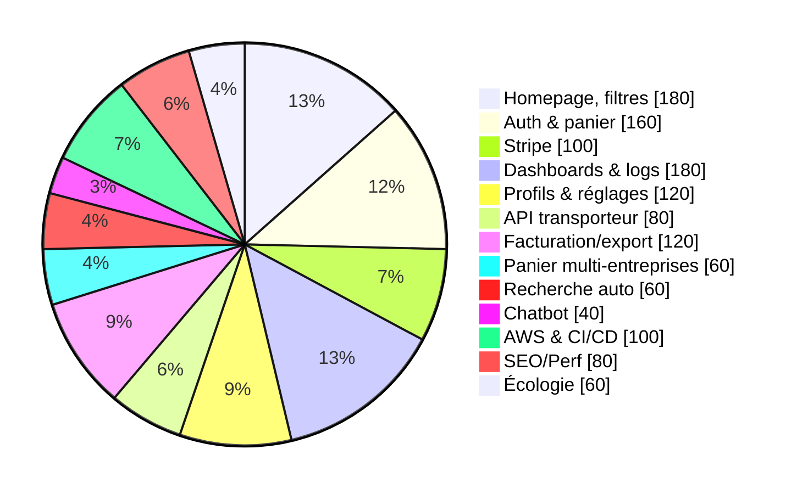

# Résumé exécutif — Marketplace B2B Laboratoire
Brief deck prêt à présenter. Format type slides (`---` pour séparer).

---
## Vision & objectif
- Créer une marketplace B2B dédiée au matériel de laboratoire d’occasion et à la réparation.
- Maximiser valeur écologique (économie circulaire, ESS) tout en assurant conformité RGPD et sécurité.
- Trouver l’option la plus robuste en coût, qualité et pérennité.

---
## Périmètre fonctionnel clé
- Navigation pro : catégories, filtres multi-critères, pagination, recherche avec autocomplétion, SEO avancé, suivi écologique produit.
- Comptes : profils entreprise/laboratoire, permissions, consentements RGPD, paramètres.
- Transactions : panier B2B mono-entreprise, prix dynamiques, promotions, paiement Stripe, suivi carbone par transaction.
- Facturation & pilotage : PDF, export comptable, archivage, dashboards financiers/écologiques, logging/audit.
- Intégrations : transporteur (API), webhooks, chatbot optionnel.
- Durabilité & sécurité : indicateurs carbone, architecture sobre, chiffrement, accès restreint, audits.

---
## Architecture cible (optimisée)
```mermaid
graph LR
  subgraph Frontend
    Next[Next.js (React RSC)]
  end
  subgraph Backend_Metier
    Lar[Laravel API]
  end
  subgraph Realtime_Int
    Nest[NestJS / Node]
  end
  DB[(PostgreSQL - Neon)]
  Stripe[[Stripe PCI-DSS]]
  S3[S3/AWS stockage]
  Next --> Lar
  Next --> Nest
  Lar --> DB
  Nest --> DB
  Lar --> Stripe
  Lar --> S3
  Nest -->|"Webhooks / Transport"| Lar
  classDef cloud fill:#0a5cf5,stroke:#003,stroke-width:1,color:#fff;
  class Next,Lar,Nest cloud;
```
- Infra : dev sur Render/Supabase, prod AWS optimisée performance & sobriété.

---
## Architecture alternative (simple)
- Frontend : Next.js
- Backend : Node.js pur (REST)
- DB : PostgreSQL
- Moins optimisée (sécurité/maintenabilité), mais compétence JS unique.

---
## Charge & séniorité

- Mix : 60 % juniors / 40 % seniors.

---
## Scénarios de réalisation
- **Agence FR** : 160–300 k€ HT ; 9–12 mois ; + qualité contractuelle ; – coût haut.
- **Équipe interne FR** : 220–290 k€/an ; 9–12 mois ; + contrôle ; – charge RH.
- **Stagiaires seuls** : non viable.
- **Option Liban supervisée** : 75–85 k€ ; + coût réduit, supervision interne pour qualité/ESS.
- **Freelances internationaux** : 100 k€+ ; + flex ; – coordination/dépendance.

---
## RGPD & sécurité (essentiels)
- Données : clients, paiements, navigation, facturation.
- Mesures : chiffrement, journalisation, accès restreint, revues de code, tests sécu.
- Org : DPO, registre traitements, clauses sous-traitants, sensibilisation équipes.
- Mitigation : audits réguliers, contrats stricts, playbook incident.

---
## Durabilité & ESS
- Code et infra optimisés énergie (caching, SSR ciblé, DB efficiente).
- Indicateurs carbone par transaction et transport, benchmarks vs marché.
- Reporting régulier et pilotage stratégique ESS / économie circulaire.

---
## Analyse des risques
| Risque | Probabilité | Impact | Mitigation |
| --- | --- | --- | --- |
| Non-conformité RGPD | Moyen | Élevé | Audit, DPO, contrats, formation |
| Fuite de données | Faible | Élevé | Chiffrement, IAM, monitoring |
| Déviation fonctionnelle | Moyen | Moyen | Supervision interne, specs vivantes |
| Dépassement budget | Faible | Élevé | Suivi mensuel, ajustement équipe |
| Retard projet | Moyen | Élevé | Sprints courts, revues régulières |
| Impact écologique non conforme | Moyen | Moyen | Reporting carbone, optimisation |

---
## Comparaison synthétique des coûts
- Agence France : 160–300 k€
- Équipe interne France : 220–290 k€
- Stagiaires : non viable
- Option Liban : 75–85 k€
- Freelances internationaux : 100 k€+

---
## Recommandation finale
- Option prioritaire : option Liban qualifiée + supervision interne pour garantir qualité, RGPD et suivi écologique.
- Démarrer avec socle Next.js + Laravel + NestJS ; intégrer KPIs carbone dès la conception.
- Formaliser gouvernance, contrats, et rituels de contrôle qualité/sécurité dès le lancement.

